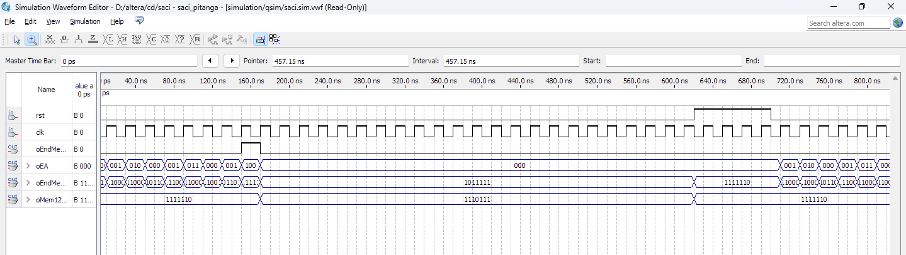
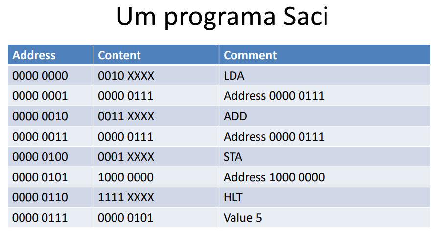

# Relatório do trabalho de Circuitos Digitais

## Descrição dos módulos

### saci_pitanga
Top-level do SACI, conecta todos os módulos internos e define as entradas/saídas principais do sistema. Foi minimalmente alterado da versão original para melhorar legibilidade e permitir alguns testes

### controle_saci_pit
Máquina de estados que controla o SACI. Gera os sinais de controle. Alterada para lógica combinacional com portas lógicas mais os registradores

### saida_mealy
Lógica combinacional para gerar o sinal de avanço do PC (enPC), do tipo Mealy, dependendo do estado atual e da instrução.

### saidas_moore
Gera sinais de controle do tipo Moore, dependentes apenas do estado atual da FSM.

### ccpe
Calcula o próximo estado da máquina de estados com base no estado atual e na instrução, de forma combinacional.

### trad_inst_pit
Traduz instruções de 4 bits para códigos de 2 bits. Alterada para portas lógicas.

### ula_pit
Unidade Lógica e Aritmética que realiza soma ou passagem direta do operando, conforme o sinal de controle. Instancia o somador_8b pra realizar a soma.

### memoria_pit
Gerencia a memória do sistema, escolhendo com um mux entre ROM e RAM, e controlando escrita/leitura.

### rom_prog_pit
ROM combinacional que armazena o programa fixo do SACI.

### mais_um_pit
Circuito combinacional que incrementa um valor de 8 bits em 1, utiliza o somador.

### mux21_8b_pit
Mux de 2 entradas de 8 bits.

### reg8_pit
Registrador de 8 bits com controle de reset, set e enable.

### reg3
Registrador de 3 bits com reset assíncrono, utilizado para armazenar o estado da FSM. Foi implementado de duas maneiras, com flip flops de dado e com a diretiva always. A implementação com a diretiva é necessaria para nao causa erros de compilação.

### d_flipflop
Flip-flop tipo D com reset assíncrono.

### somador_8b
Somador de 8 bits, implementado com full adders em sequência, usado na ULA e incrementador.

### full_adder
Somador completo de 1 bit.

### display7seg
Conversor de 4 bits para código de display de 7 segmentos, para visualização na placa.

## Processo de adaptação do código base

### Adaptação do código base saci_pitanga-caixas_separadas.v para pitanga.v

O arquivo `pitanga.v` foi desenvolvido a partir do código base `saci_pitanga-caixas_separadas.v`, realizando diversas adaptações para garantir a síntese e o funcionamento correto na placa Pitanga. As principais mudanças e implementações foram:

- **Conversão de módulos comportamentais para portas lógicas:** Muitos módulos originalmente escritos com diretivas `always` (como registradores, flip-flops, máquina de estados e lógica de controle) foram reescritos utilizando apenas portas lógicas e instanciamento explícito de componentes. Essa conversão foi feita para atender ao objetivo pedagógico do trabalho, que exigia a descrição de todo o processador utilizando apenas portas lógicas.

- **Reimplementação do reg3:** O registrador de 3 bits responsável pelo estado da FSM foi refeito para utilizar flip-flops D implementados com portas lógicas.

- **Ajustes em somadores:** O somador de 8 bits e o full adder foram reimplementados com portas lógicas, substituindo half adders por full adders, garantindo funcionamento correto tanto na ULA quanto no incrementador.

- **Padronização de reset assíncrono:** Todos os registradores e flip-flops foram adaptados para garantir reset assíncrono, facilitando a inicialização e depuração do sistema.

- **Correções de lógica combinacional:** Foram corrigidos detalhes na tradução de sinais de controle (Moore e Mealy), na lógica de transição de estados (`ccpe`) e na tradução de instruções, para garantir que todos os casos fossem tratados corretamente, inclusive os casos default.

- **Documentação e comentários:** O código foi amplamente comentado para facilitar a compreensão e manutenção, detalhando o funcionamento de cada módulo e as decisões de projeto.

Essas adaptações permitiram que o processador SACI fosse sintetizado e testado com sucesso na placa Pitanga, superando as limitações de entradas/saídas e garantindo a correta execução do programa de exemplo.

## Correções feitas na versão mais recente

### somador e full_adder
Antes estava implementado com half adders, o que funcionava para o mais_um_pit mas nao pra ula. Alterado para full adders.

### flip flop
Estava implementado com portas lógicas, o que não estava permitindo a síntese do sistema. Foi mudado para diretivas always. O erro deste módulo causou grande dificuldade em testar os outros módulos.

### reg3
Teve que ser mudado para permitir compilação com sucesso na placa pitanga. Versão original era sintetizavel pelo Quartus, motivo deste erro específico não foi encontrado.

Reg 3 teve que ser implementado com a diretiva always, pois o flip flop não estava sintetizando corretamente. A implementação com flip flop de dado não estava compilando.

### reg8
Adaptado para o novo modulo do flip flop.

### mais_um_pit
Adaptado pro somador corrigido (nomes mudados)

### ccpe
Tinha erros na tradução de assign para portas logicas, em um valore específico. Também estava dando 000 pros casos default (deveria ser 101). Casos foram arrumados e foi adicionada lógica pra detectar e consertar o caso default.
Poderia ser simplificado com mapa de karnaugh e a lógica do caso default, mas foi mantida essa implementação pois é funcional. 

### saidas moore, rom, memória e traducão de instrução
Estes módulos tinha algums errinhos na conversão do assign pra portas lógicas. Foram corrigidos estes erros, pra não ter divergências nas saidas esperadas.

## Dificuldades encontradas

### Verificar as saidas da maquina de estados
Como as maquinas de estado e as saidas moore e mealy tinham varios casos de teste, acabou sendo bem facil algum valor errado passar desapercebido.

### Implementação e testes do SACI na placa Pitanga
O trabalho foi testado parcialmente na placa Pitanga e as partes mais complexas foram validadas no Quartus.
Como a placa tinha poucas entradas, era difícil testar todos os casos diretamente no simulador. Quando o processador ficou totalmente pronto, o processo de compilação e síntese para a placa Pitanga apresentou alguns desafios, mas foi possível identificar e corrigir o erro no módulo reg3, permitindo o funcionamento correto do sistema.

## Validação e funcionamento do SACI

### Simulação da máquina de estados (waveform)

Abaixo está a simulação da waveform obtida no Quartus, mostrando o comportamento dos sinais principais e dos estados da máquina de estados (EA):

**Legenda dos estados (EA):**
- `000`: lê operação (após reset, inicia em 000)
- `001`: lê endereço imediato
- `010`: LDA
- `011`: ADD
- `100`: STA

O estado EA inicia em `000` após o reset, conforme esperado. A transição entre os estados pode ser observada na linha correspondente ao sinal `oEA` na simulação.

### Programa gravado na ROM (rom_prog_pit)

O programa abaixo está implementado no módulo `rom_prog_pit` e é responsável por somar dois valores (5 + 5) e armazenar o resultado na posição 128 da memória. A tabela mostra o conteúdo da ROM, com os endereços, instruções e comentários:

Este é o código que o SACI executa por padrão, pois está gravado na ROM do módulo `rom_prog_pit`. Sempre que o processador é ligado ou resetado, ele inicia a execução a partir deste programa, já que a ROM é fixa e não pode ser alterada durante a operação normal.

Cada linha representa uma posição de memória da ROM, com a instrução ou dado correspondente. O programa segue a seguinte lógica:
- Lê o valor 5 da posição 7
- Soma 5 + 5
- Armazena o resultado na posição 128
- Finaliza com a instrução HLT

